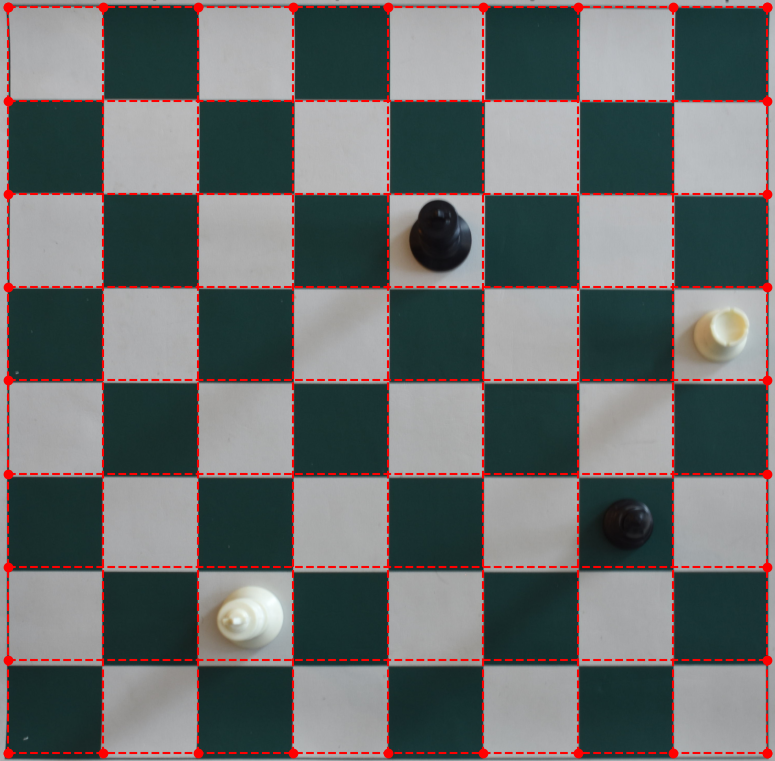
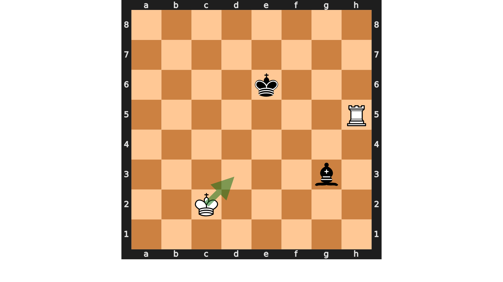

# ♟️ Play Chess For Me 🧩

**Play Chess For Me** is an open-source Python tool designed to detect chessboards in images, transform them into a top-down view, detect chess pieces, and convert the board state into FEN (Forsyth-Edwards Notation) format for use in chess applications.

## 🎯 Features
- Detects chessboard corners in images using deep learning.
- Warps the chessboard into a top-down perspective.
- Detects the positions of chess pieces.
- Converts board states into FEN notation.
- Provides a demo pipeline to visualize intermediate outputs.


## 🚀 How to Run the Project

Follow these steps to get started:

1. **Clone the Repository**  
   ```bash
   git clone https://github.com/MajidRaimi/play-chess-for-me.git
   cd play-chess-for-me
   ```

2. **Create and Activate a Virtual Environment**  
   ```bash
   python -m venv venv
   source venv/bin/activate  # For Linux/MacOS
   venv\Scripts\activate     # For Windows
   ```

3. **Install Requirements**  
   ```bash
   pip install -r requirements.txt
   ```

4. **Run the Project**  
   Use the following command to process an image of a chessboard:
   ```bash
   python . path/to/chessboard/image.png
   ```

---

## 📄 LICENSE

This project is licensed under the **MIT License**. Feel free to use, modify, and distribute it! See the [LICENSE](LICENSE) file for more details.

---

## 🗂️ File Structure

Here's an overview of the project structure:

```plaintext
├── .gitignore                  # Ignored files and directories
├── __main__.py                 # Main entry point of the application
├── assets
│   └── models                  # Pre-trained models for corner and piece detection
├── core
│   ├── constants               # Constants and error messages
│   └── shared                  # Core logic: FEN conversion, perspective transformation, etc.
├── notebooks                   # Jupyter notebooks for training and testing
├── pipe                        # Demo images showing intermediate pipeline steps
├── pipeline.py                 # Main pipeline logic for processing images
└── requirements.txt            # Required Python libraries
```

---

## 🎨 Demo

The table below showcases the intermediate outputs of the pipeline using the images inside the `pipe/` folder:

<div align="center">

<table>
<tr>
    <td align="center">
        <b>Original Image</b><br>
        
    </td>
    <td align="center">
        <b>Detected Corners</b><br>
        
    </td>
    <td align="center">
        <b>Transformed Chessboard</b><br>
        
    </td>
</tr>
<tr>
    <td align="center">
        <b>Chessboard with Grid Overlay</b><br>
        
    </td>
    <td align="center">
        <b>Detected Pieces</b><br>
        
    </td>
    <td align="center">
        <b>Best Move</b><br>
        
    </td>
</tr>

</table>

</div>
---

## 📚 Libraries Used

This project leverages several powerful libraries. Below are the libraries used with a brief description:

- [**YOLOv5**](https://github.com/ultralytics/yolov5) 🧠: Used for corner and chess piece detection.
- [**OpenCV**](https://opencv.org/) 📸: Handles image transformations, perspective corrections, and grid overlays.
- [**NumPy**](https://numpy.org/) 🔢: Provides efficient array operations for data manipulation.
- [**Matplotlib**](https://matplotlib.org/) 📊: Visualizes intermediate results and pipeline outputs.
- [**Torch**](https://pytorch.org/) 🔥: Deep learning framework for training and deploying models.
- [**argparse**](https://docs.python.org/3/library/argparse.html) 🛠️: Parses command-line arguments for a seamless user interface.

---

## ✨ Contributing

Contributions are welcome! Feel free to fork the repository and submit a pull request. For major changes, please open an issue first to discuss what you'd like to change.

---

## 💬 Feedback

We'd love to hear your thoughts! Create an issue or start a discussion in the repository to share your ideas.

**Happy Chess-ing!** ♟️✨